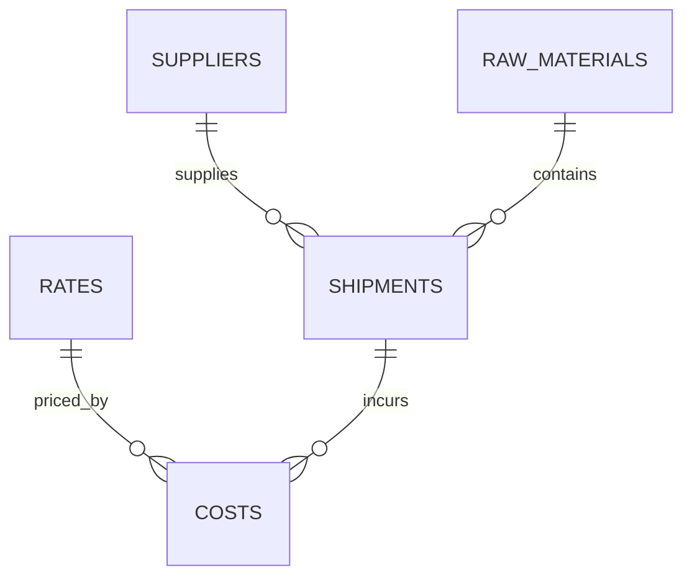

# Rail Logistics Analytics (SQL → Tableau → Power BI)

Кейс по логистике сырья: план–факт затрат, OTIF, dwell time, utilization.

## Что внутри
- **SQL**: запросы для KPI (план–факт, OTIF, dwell, топ-экспедиторы, динамика затрат).
- **Tableau / Power BI**: 1–2 дашборда для руководства (ссылки ниже).
- **Данные**: примерные CSV/скрипты для быстрой проверки.

## Структура
data/ примеры данных

schema/ создание таблиц

sql/ готовые запросы

bi/ файлы Tableau/Power BI (когда будут готовы)

assets/ скриншоты дашбордов 

## ERD (схема данных)

KPI
План–факт затрат (цель: ≤ 3%)

OTIF (on-time-in-full) и dwell time по станциям

Utilization (rail/truck), Top-10 экспедиторы, динамика затрат по месяцам

Дашборды
Tableau Public: [вставь ссылку, когда опубликуешь]

Power BI: файл .pbix в /bi + [ссылка] (если опубликуешь в сервис)

## SQL (примеры)
- [sql/01_cost_plan_vs_actual.sql](sql/01_cost_plan_vs_actual.sql)
- [sql/02_otif_by_plant.sql](sql/02_otif_by_plant.sql)
- [sql/03_dwell_time_by_station.sql](sql/03_dwell_time_by_station.sql)
- [sql/04_top10_forwarders.sql](sql/04_top10_forwarders.sql)
- [sql/05_monthly_cost_trend.sql](sql/05_monthly_cost_trend.sql)

Как запустить локально
Импортируйте CSV из /data в БД (или используйте скрипты из /schema).

Выполните запросы из /sql.

Откройте Tableau/Power BI файл из /bi и обновите источник данных.

Скриншоты
(добавим позже)

## Навыки
SQL · Tableau · Power BI · Supply Chain · Procurement · KPI · Data Visualization
